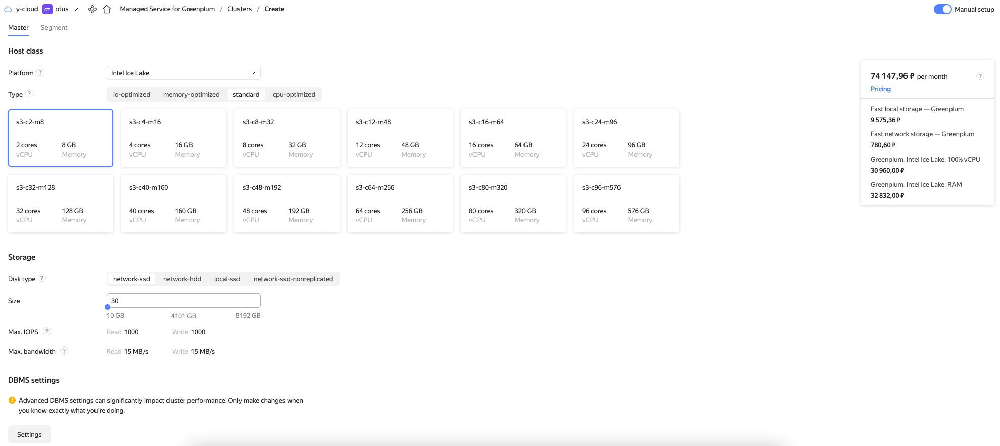

# Data Vault powered by dbtVault and Greenplum

- Build Data Vault powered by [dbtVault](https://dbtvault.readthedocs.io/) and [Greenplum](https://greenplum.org/)
- Deploy Infrastructure as Code with [Terraform](https://www.terraform.io/) and [Yandex.Cloud](https://cloud.yandex.com/en-ru/)
- Instant development with [Github Codespaces](https://docs.github.com/en/codespaces)
- Assignment checks with [Github Actions](https://github.com/features/actions)

## Assignment TODO

⚠️ Attention! Always delete resources after you finish your work!

- [ ] [Fork this repository](https://docs.github.com/en/get-started/quickstart/fork-a-repo)
- [ ] [Configure Developer Environment]()
- [ ] [Deploy Infrastructure]()
- [ ] [Check database connection]()
- [ ] [Populate Data Vault day-by-day]()
- [ ] [Build Business Vault on top of Data Vault]()
- [ ] [Create PR and pass CI tests]()

## 1. Configure Developer Environment

1. You have got 3 options to set up:
 
    <details><summary>Start with GitHub Codespaces / Dev Container:</summary>
    <p>

    Open in Github Codespace:

    

    Or open in a local Dev Container (VS Code):

    

    </p>
    </details>

    <details><summary>Set up Docker containers manually:</summary>
    <p>

    Install [Docker](https://docs.docker.com/desktop/#download-and-install) and run commands:

    ```bash
    # build & run container
    docker-compose build
    docker-compose up -d

    # alias docker exec command
    alias dbt="docker-compose exec dev dbt"
    ```

    </p>
    </details>

    <details><summary>Alternatively, install on a local machine:</summary>
    <p>

    1. [Install dbt](https://docs.getdbt.com/dbt-cli/install/overview)

        [Configure profile](https://docs.getdbt.com/dbt-cli/configure-your-profile) manually by yourself. By default, dbt expects the `profiles.yml` file to be located in the `~/.dbt/` directory. Use this [template](./profiles.yml) and enter your own credentials.

    1. Intsall [yc CLI](https://cloud.yandex.com/en-ru/docs/cli/operations/install-cli)

    1. Install [Terraform](https://developer.hashicorp.com/terraform/tutorials/aws-get-started/install-cli)

    </p>
    </details>

1. Populate `.env` file

    `.env` is used to store secrets as environment variables.

    Copy template file [.env.template](./.env.template) to `.env` file:
    
    ```bash
    cp .env.template .env
    ```

    Open file in editor and set your own values.

    > ❗️ Never commit secrets to git    

## 2. Deploy Infrastructure

1. Get familiar with Managed Service for Greenplum

    

1. Install and configure `yc` CLI: [Getting started with the command-line interface by Yandex Cloud](https://cloud.yandex.com/en/docs/cli/quickstart#install)

    ```bash
    yc init
    ```

1. Set environment variables:

    ```bash
    export YC_TOKEN=$(yc iam create-token)
    export YC_CLOUD_ID=$(yc config get cloud-id)
    export YC_FOLDER_ID=$(yc config get folder-id)
    export TF_VAR_folder_id=$(yc config get folder-id)
    export $(xargs <.env)
    ```

1. Deploy using Terraform

    ```bash
    terraform init
    terraform validate
    terraform fmt
    terraform plan
    terraform apply
    ```

    Store terraform output values as Environment Variables:

    ```bash
    export DBT_HOST=$(terraform output -raw greenplum_host_fqdn)
    export DBT_USER='greenplum'
    export DBT_PASSWORD=${TF_VAR_greenplum_password}
    export S3_ACCESSKEY=$(terraform output -raw access_key)
    export S3_SECRETKEY=$(terraform output -raw secret_key)
    ```

    [EN] Reference: [Getting started with Terraform by Yandex Cloud](https://cloud.yandex.com/en/docs/tutorials/infrastructure-management/terraform-quickstart)
    
    [RU] Reference: [Начало работы с Terraform by Yandex Cloud](https://cloud.yandex.ru/docs/tutorials/infrastructure-management/terraform-quickstart)

1. Alternatively, deploy using yc CLI

    <details><summary>Deploy using yc CLI:</summary>
    <p>

    Checklist:
    - Egress NAT (required to access s3): https://cloud.yandex.com/en/docs/vpc/operations/create-nat-gateway
    - S3 service account keys (required for external tables access): https://cloud.yandex.com/en/docs/iam/operations/sa/create-access-key
    - Greenplum: https://cloud.yandex.com/en/docs/cli/cli-ref/managed-services/managed-greenplum/

    ```bash
    yc managed-greenplum cluster create gp_datavault \
    --network-name default \
    --zone-id ru-central1-a \
    --environment prestable \
    --master-host-count 2 \
    --segment-host-count 2 \
    --master-config resource-id=s3-c2-m8,disk-size=30,disk-type=network-ssd \
    --segment-config resource-id=s3-c2-m8,disk-size=30,disk-type=network-ssd \
    --segment-in-host 1 \
    --user-name greenplum \
    --user-password $TF_VAR_greenplum_password \
    --greenplum-version 6.22 \
    --assign-public-ip

    yc vpc gateway create --name gp-gateway
    yc vpc route-table create --name=gp-route-table --network-name=default --route destination=0.0.0.0/0,gateway-id=<gateway_id>
    yc vpc subnet update <subnet_name> --route-table-name=gp-route-table

    yc managed-greenplum hosts list master --cluster-name gp_datavault

    export DBT_HOST=$DBT_HOST
    export DBT_USER=$DBT_USER
    export DBT_PASSWORD=$TF_VAR_greenplum_password
    export S3_ACCESSKEY=$S3_ACCESSKEY
    export S3_SECRETKEY=$S3_SECRETKEY
    ```

## Check database connection

```
dbt debug
```

## Populate Data Vault day-by-day

- Initialize data sources (External tables)

```bash
dbt run-operation init_s3_sources
```

- Install packages:

```bash
dbt deps
```


Initial repo is intended to run on Snowflake only.

I have forked it and adapted to run on Greenplum/PostgreSQL.
Check out what has been changed: [47e0261cea67c3284ea409c86dacdc31b1175a39](https://github.com/kzzzr/dbtvault/tree/47e0261cea67c3284ea409c86dacdc31b1175a39)

`packages.yml`:

```yaml
packages:
  # - package: Datavault-UK/dbtvault
  #   version: 0.7.3
  - git: "https://github.com/kzzzr/dbtvault.git"
    revision: master
    warn-unpinned: false
```


1. Adapt models to Greenplum/PostgreSQL

Check out the [commit history](https://github.com/kzzzr/dbtvault_greenplum_demo/commits/master).

* [a97a224](https://github.com/kzzzr/dbtvault_greenplum_demo/commit/a97a22431a182e59c9cb8be807200f0292672b0f) - adapt prepared staging layer for greenplum - Artemiy Kozyr (HEAD -> master, kzzzr/master)
* [dfc5866](https://github.com/kzzzr/dbtvault_greenplum_demo/commit/dfc5866a63e81393f5bfc0b163cc84b56efc6354) - configure raw layer for greenplum - Artemiy Kozyr
* [bba7437](https://github.com/kzzzr/dbtvault_greenplum_demo/commit/bba7437a7d29fd5dd9c383bff49c4604fc84d2ab) - configure data sources for greenplum - Artemiy Kozyr
* [aa25600](https://github.com/kzzzr/dbtvault_greenplum_demo/commit/aa2560071b27b2e7f6de924222b7d465e28d8af2) - configure package (adapted dbt_vault) for greenplum - Artemiy Kozyr
* [eafed95](https://github.com/kzzzr/dbtvault_greenplum_demo/commit/eafed95ad5b912daf9339d877dfa0ee246bd089f) - configure dbt_project.yml for greenplum - Artemiy Kozyr


1. Run models step-by-step

Load one day to Data Vault structures:

```bash
dbt run -m tag:raw
dbt run -m tag:stage
dbt run -m tag:hub
dbt run -m tag:link
dbt run -m tag:satellite
dbt run -m tag:t_link
```

1. Load next day

Simulate next day load by incrementing `load_date` varible:

```yaml dbt_profiles.yml
# dbt_profiles.yml

vars:
  load_date: '1992-01-08' # increment by one day '1992-01-09'

```

## Build Business Vault on top of Data Vault

## Create PR and pass CI tests
