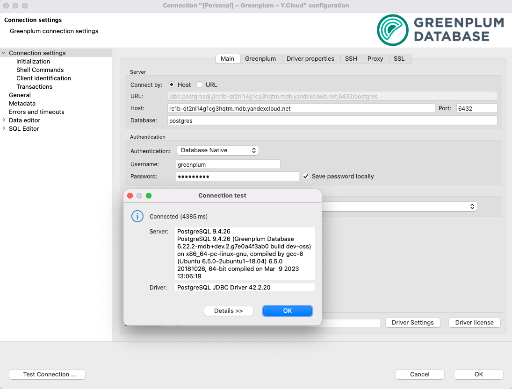
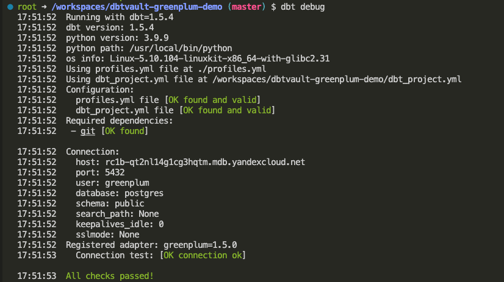

# Data Vault powered by dbtVault and Greenplum

- Build Data Vault powered by [dbtVault](https://dbtvault.readthedocs.io/) and [Greenplum](https://greenplum.org/)
- Deploy Infrastructure as Code with [Terraform](https://www.terraform.io/) and [Yandex.Cloud](https://cloud.yandex.com/en-ru/)
- Instant development with [Github Codespaces](https://docs.github.com/en/codespaces)
- Assignment checks with [Github Actions](https://github.com/features/actions)

## Assignment TODO

⚠️ Attention! Always delete resources after you finish your work!

- [ ] [Fork this repository](https://docs.github.com/en/get-started/quickstart/fork-a-repo)
- [ ] [Configure Developer Environment]()
- [ ] [Deploy Infrastructure]()
- [ ] [Check database connection]()
- [ ] [Populate Data Vault day-by-day]()
- [ ] [Build Business Vault on top of Data Vault]()
- [ ] [Create and submit PR]()

## Configure Developer Environment

You have got several options to set up:
 
<details><summary>Start with GitHub Codespaces</summary>
<p>


</p>
</details>

<details><summary>Use devcontainer (locally)</summary>
<p>

1. Install [Docker](https://docs.docker.com/desktop/#download-and-install) on your local machine.

1. Install devcontainer CLI:

    Open command palette (CMD + SHIFT+ P) type *Install devcontainer CLI*

    

1. Next build and open dev container:

    ```bash
    # build dev container
    devcontainer build .

    # open dev container
    devcontainer open .
    ```

</p>
</details>

Verify you are in a development container by running commands:

```bash
terraform -v

yc --version

dbt --version
```

If any of these commands fails printing out used software version then you are probably running it on your local machine not in a dev container!

## Deploy Infrastructure

1. Get familiar with Managed Service for Greenplum

    

1. Install and configure `yc` CLI: [Getting started with the command-line interface by Yandex Cloud](https://cloud.yandex.com/en/docs/cli/quickstart#install)

    ```bash
    yc init
    ```

1. Populate `.env` file

    `.env` is used to store secrets as environment variables.

    Copy template file [.env.template](./.env.template) to `.env` file:
    
    ```bash
    cp .env.template .env
    ```

    Open file in editor and set your own values.

    > ❗️ Never commit secrets to git

1. Set environment variables:

    ```bash
    export YC_TOKEN=$(yc iam create-token)
    export YC_CLOUD_ID=$(yc config get cloud-id)
    export YC_FOLDER_ID=$(yc config get folder-id)
    export TF_VAR_folder_id=$(yc config get folder-id)
    export $(xargs <.env)
    ```

1. Deploy using Terraform

    Configure YC Terraform provider:
    
    ```bash
    cp terraformrc ~/.terraformrc
    ```

    ```bash
    terraform init
    terraform validate
    terraform fmt
    terraform plan
    terraform apply
    ```

    Store terraform output values as Environment Variables:

    ```bash
    export DBT_HOST=$(terraform output -raw greenplum_host_fqdn)
    export DBT_USER='greenplum'
    export DBT_PASSWORD=${TF_VAR_greenplum_password}
    export S3_ACCESSKEY=$(terraform output -raw access_key)
    export S3_SECRETKEY=$(terraform output -raw secret_key)
    ```

    [EN] Reference: [Getting started with Terraform by Yandex Cloud](https://cloud.yandex.com/en/docs/tutorials/infrastructure-management/terraform-quickstart)
    
    [RU] Reference: [Начало работы с Terraform by Yandex Cloud](https://cloud.yandex.ru/docs/tutorials/infrastructure-management/terraform-quickstart)

1. Alternatively, deploy using yc CLI

    <details><summary>Deploy using yc CLI:</summary>
    <p>

    Checklist:
    - Egress NAT (required to access s3): https://cloud.yandex.com/en/docs/vpc/operations/create-nat-gateway
    - S3 service account keys (required for external tables access): https://cloud.yandex.com/en/docs/iam/operations/sa/create-access-key
    - Greenplum: https://cloud.yandex.com/en/docs/cli/cli-ref/managed-services/managed-greenplum/

    ```bash
    yc managed-greenplum cluster create gp_datavault \
    --network-name default \
    --zone-id ru-central1-a \
    --environment prestable \
    --master-host-count 2 \
    --segment-host-count 2 \
    --master-config resource-id=s3-c2-m8,disk-size=30,disk-type=network-ssd \
    --segment-config resource-id=s3-c2-m8,disk-size=30,disk-type=network-ssd \
    --segment-in-host 1 \
    --user-name greenplum \
    --user-password $TF_VAR_greenplum_password \
    --greenplum-version 6.22 \
    --assign-public-ip

    yc vpc gateway create --name gp-gateway
    yc vpc route-table create --name=gp-route-table --network-name=default --route destination=0.0.0.0/0,gateway-id=<gateway_id>
    yc vpc subnet update <subnet_name> --route-table-name=gp-route-table

    yc managed-greenplum hosts list master --cluster-name gp_datavault

    export DBT_HOST=$DBT_HOST
    export DBT_USER=$DBT_USER
    export DBT_PASSWORD=$TF_VAR_greenplum_password
    export S3_ACCESSKEY=$S3_ACCESSKEY
    export S3_SECRETKEY=$S3_SECRETKEY
    ```
    </p>
    </details>

## Check database connection

[Configure JDBC (DBeaver) connection](https://cloud.yandex.ru/docs/managed-greenplum/operations/connect):




Make sure dbt can connect to your target database:

```bash
dbt debug
```



If any errors check ENV values are present:

```bash
env | grep DBT_
```

## Populate Data Vault day-by-day

1. Initialize data sources (External tables)

```bash
dbt run-operation init_s3_sources
```

1. Install packages:

```bash
dbt deps
```

1. Run models step-by-step

Load one day to Data Vault structures:

```bash
dbt run -m tag:raw
dbt run -m tag:stage

dbt run -m tag:hub
dbt run -m tag:link
dbt run -m tag:satellite
dbt run -m tag:t_link
```

1. Load next day

Simulate next day load by incrementing `load_date` varible:

```yaml dbt_profiles.yml
# dbt_profiles.yml

vars:
  load_date: '1992-01-02' # increment by one day
```

And update data vault:

```bash
dbt build
```

## Build Business Vault on top of Data Vault

1. [Point In Time (PIT) table](https://automate-dv.readthedocs.io/en/latest/tutorial/tut_point_in_time/)
2. [Bridge Table](https://automate-dv.readthedocs.io/en/latest/tutorial/tut_bridges/)

```bash
dbt run -s as_of_date - Creating as_of_date 

dbt run -s pitne_customer - Creating PIT

dbt run -s bridge_customer_nation - Creating bridge table with nations
```

## Answers to the questions:
1. Load 4-5 days to Data Vault and play with view/table
```bash
When I use materialized table for raw_stage in dbt_project.yml, it takes 87.44 seconds to complete 'dbt build'.
With materialized - view for raw_stage in dbt_project.yml, it takes 18 minutes and 19.12 seconds to complete 'dbt build'.
```

2. Prepare Point-in-Time & Bridge Tables
```bash
I've done it: commands with 'dbt run' are listed above the section with answers.
```

3. Now run a couple of queries on top of models you have built

The query on top of PIT:


```bash
select
    customer_pk,
    COUNT(distinct sat_order_customer_details_ldts) AS "ORDER_CUSTOMER_DETAILS_LDTS"
FROM
    pitne_customer
WHERE
    as_of_date <= date '1992-01-03' and as_of_date >= '1992-01-02'
group by 
    customer_pk
limit 
    10;

customer_pk     |ORDER_CUSTOMER_DETAILS_LDTS|
----------------+---------------------------+
⯠[ÊTÆ:ÚÆþ  Þ!Ë|                          1|
Q©|HÞ 4Zíï #û}/ |                          2|
jg­IF Y@q\ W¥ +y|                          1|
ÂK àý ýµQ±. D g¼|                          1|
ïxil×  bÝ5+fò Ï |                          1|
àJ ]Ïò8Ú biÇöØþü|                          1|
ê. §åÃw(<ú ³ ä$7|                          1|
 å _×­6¡Io0Ë äÁ5|                          1|
t æ  ìvxm©ñ'ÏÛßo|                          1|
 ^»ìN[ÈØ÷  Ûø &z|                          1|

10 row(s) fetched  - 42 ms.
```


The query on top of Bridge Table:

```bash
select * 
from bridge_customer_nation bcn 
join public.link_customer_nation lcn
on bcn.customer_pk =lcn.customer_pk
where load_date < date '1992-01-02'
limit 7;  

customer_pk     |customer_nation_name     |link_customer_nation_pk|customer_pk     |nation_pk       |load_date |record_source|
----------------+-------------------------+-----------------------+----------------+----------------+----------+-------------+
x; b ïò  ÒiÖÅÕ6Ð|MOROCCO                  |ÉYgÀÔ&Þ b_Øu¸µ         |x; b ïò  ÒiÖÅÕ6Ð| ó  ðb j ÓȽ  /ó|1992-01-01|TPCH-ORDERS  |
ã =6ûS è ýI    q|JORDAN                   |^Þ  ²ö£¢óâ; 2æ b       |ã =6ûS è ýI    q|Å ä Á$¡  µä¹ ¯9|1992-01-01|TPCH-ORDERS  |
Yr4 u§É IϨE [~å|IRAN                     |ÂM°ýàÝö \°¯XÌI½ñ       |Yr4 u§É IϨE [~å|ÓÙDh ¤BYu]8æÑcè |1992-01-01|TPCH-ORDERS  |
 6PÝ `Xy ³×qÏ  q|GERMANY                  | ¾ px­Ó > C>ÈBïá       | 6PÝ `Xy ³×qÏ  q|  ä_Îê zZ6ÞÝKê%C|1992-01-01|TPCH-ORDERS  |
« G$ [kãA u ìX?o|CHINA                    |   bh¢  às#Ç6H®ä       |« G$ [kãA u ìX?o|oI"ôUh   ßJÒ) m#|1992-01-01|TPCH-ORDERS  |
w½i $<¼¢  Ó¼u¥²Ë|RUSSIA                   |)­  _ç «O° ÞrÃÆ        |w½i $<¼¢  Ó¼u¥²Ë|¶×gÒøí]!¤K X h ¹|1992-01-01|TPCH-ORDERS  |
Q¥ ¥  5Ð ÌO."Å f|INDONESIA                |f¡ó S¶k¥ §Áé  eQ       |Q¥ ¥  5Ð ÌO."Å f|EÄ Î.- ½ê üQÇÆ­&|1992-01-01|TPCH-ORDERS  |


7 row(s) fetched  - 26 ms.
```

4. Compare disk space

```bash

Линк

SELECT pg_size_pretty(pg_relation_size('public.link_customer_nation'));
pg_size_pretty|
--------------+
134 kB        |
```

```bash

PIT

SELECT pg_size_pretty(pg_relation_size('public.pitne_customer'));
pg_size_pretty|
--------------+
355 kB        |
```

```bash

Bridge Table

SELECT pg_size_pretty(pg_relation_size('public.bridge_customer_nation'));
pg_size_pretty|
--------------+
66 kB         |
```


5. Play with Clickhouse
```bash
Is it possible to run Data Vault on Clickhouse? Will it be able to handle incremental materialization for raw vault?

We are already using raw_vault with incremental materialization (dbt_project.yml file), so I guess the answer is 'yes'
```

## Create and submit PR

